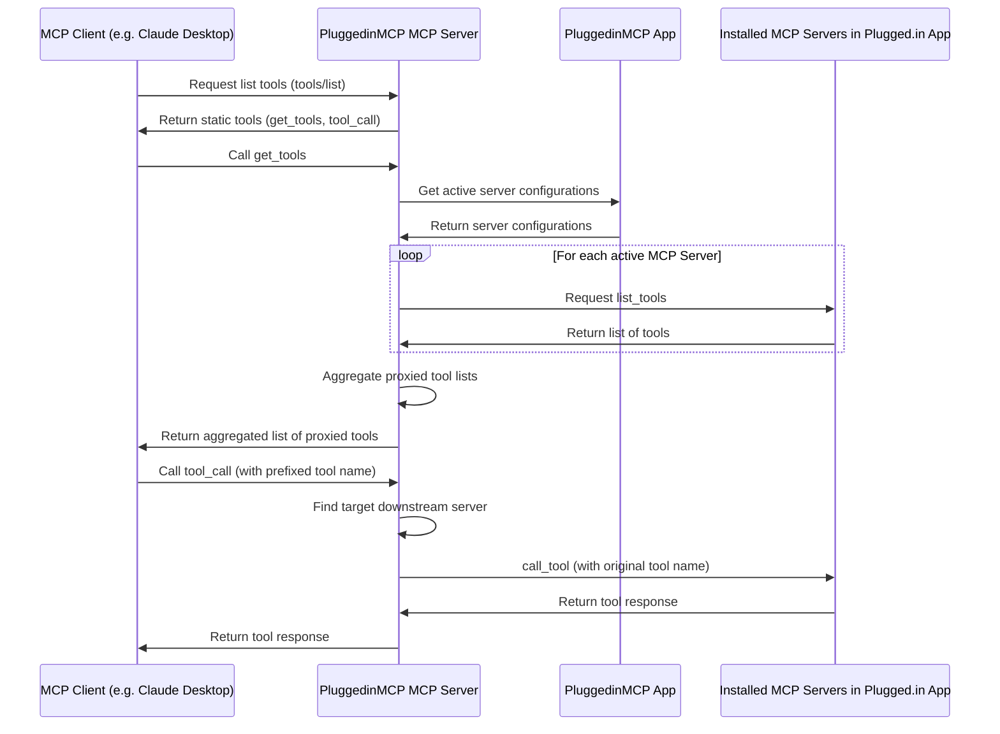

# PluggedinMCP MCP Server

[https://plugged.in](https://plugged.in): The One MCP to manage all your MCPs

PluggedinMCP MCP Server is a proxy server that joins multiple MCP⁠ servers into one. It fetches tool/prompt/resource configurations from PluggedinMCP App⁠ and routes tool/prompt/resource requests to the correct underlying server.

[](https://smithery.ai/server/@VeriTeknik/pluggedin-mcp-proxy)


PluggedinMCP App repo: https://github.com/VeriTeknik/pluggedin-app

## Key Features

- **MCP Playground**: Interactive environment to test and experiment with your MCP tools
- **Multi-Server Support**: Connect both STDIO (command-line) and SSE (HTTP-based) MCP servers
- **Custom MCP Servers**: Create and manage your own Python-based MCP servers
- **Multi-Workspace Layer**: Switch between different sets of MCP configurations with one click
- **Namespace Isolation**: Keep joined MCPs separate and organized
- **LLM Integration**: Seamless integration with OpenAI and Anthropic models
- **Real-time Updates**: GUI dynamic updates of MCP configurations
- **Universal Compatibility**: Works with any MCP client
- **Smithery Compatibility**: Includes static `get_tools` and `tool_call` endpoints for improved compatibility with discovery platforms like Smithery.
- **Dynamic Versioning**: Server version is read dynamically from `package.json`.

## Installation

### Installing via Smithery

Sometimes Smithery works (confirmed in Windsurf locally) but sometimes it is unstable because PluggedinMCP is special that it runs other MCPs on top of it. Please consider using manual installation if it doesn't work instead.

To install PluggedinMCP MCP Server for Claude Desktop automatically via [Smithery](https://smithery.ai/server/@VeriTeknik/pluggedin-mcp-proxy):

```bash
npx -y @smithery/cli install @VeriTeknik/pluggedin-mcp-proxy --client claude
```

### Manual Installation

```bash
export PLUGGEDIN_API_KEY=<env>
npx -y @pluggedin/pluggedin-mcp-proxy@latest
```

```json
{
  "mcpServers": {
    "PluggedinMCP": {
      "command": "npx",
      "args": ["-y", "@pluggedin/pluggedin-mcp-proxy@latest"],
      "env": {
        "PLUGGEDIN_API_KEY": "<your api key>"
      }
    }
  }
}
```

## Environment Variables

- PLUGGEDIN_API_KEY: Required. Obtained from PluggedinMCP App's "API Keys" page (https://plugged.in/api-keys).
- PLUGGEDIN_API_BASE_URL: Optional override for PluggedinMCP App URL (e.g. http://localhost:12005).

## Command Line Arguments

You can configure the API key and base URL using command line arguments:

```bash
npx -y @pluggedin/pluggedin-mcp-proxy@latest --pluggedin-api-key <your-api-key> --pluggedin-api-base-url <base-url>
```

For help with all available options:

```bash
npx -y @pluggedin/pluggedin-mcp-proxy@latest --help
```

These command line arguments take precedence over environment variables.

## Architecture Overview



## Credits
- Forked from https://github.com/metatool-ai/mcp-server-metamcp
- Inspirations and some code (refactored in this project) from https://github.com/adamwattis/mcp-proxy-server/
