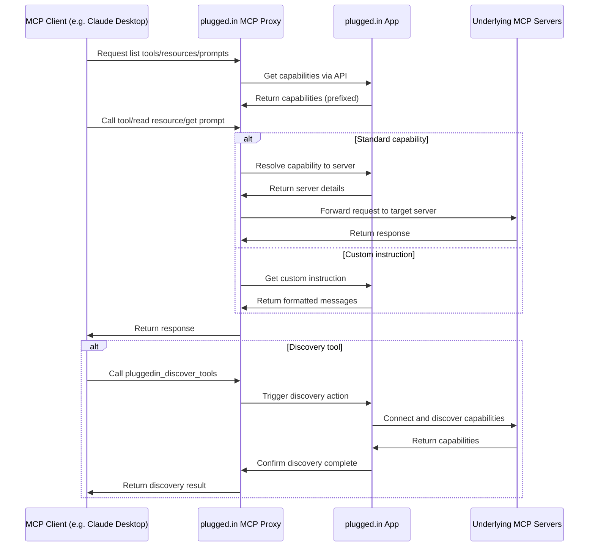

# plugged.in MCP Proxy Server

<div align="center">
  
  <h3>The Crossroads for AI Data Exchanges</h3>
  <p>A unified interface for managing all your MCP servers</p>

  [](https://github.com/VeriTeknik/pluggedin-mcp/stargazers)
  [](LICENSE)
  [](https://www.typescriptlang.org/)
  [](https://modelcontextprotocol.io/)
</div>

## 📋 Overview

The plugged.in MCP Proxy Server is a powerful middleware that aggregates multiple Model Context Protocol (MCP) servers into a single unified interface. It fetches tool, prompt, and resource configurations from the [plugged.in App](https://github.com/VeriTeknik/pluggedin-app) and intelligently routes requests to the appropriate underlying MCP servers.

This proxy enables seamless integration with any MCP client (Claude, Cline, Cursor, etc.) while providing advanced management capabilities through the plugged.in ecosystem.

## ✨ Key Features

- **Universal MCP Compatibility**: Works with any MCP client including Claude Desktop, Cline, and Cursor
- **Multi-Server Support**: Connect both STDIO (command-line) and WebSocket (HTTP-based) MCP servers
- **Namespace Isolation**: Keep joined MCPs separate and organized with proper prefixing
- **Multi-Workspace Layer**: Switch between different sets of MCP configurations with one click
- **Simplified Architecture**: Streamlined codebase with improved startup time and reduced complexity
- **API-Driven Proxy**: Fetches capabilities from plugged.in App APIs rather than direct discovery
- **Full MCP Support**: Handles tools, resources, resource templates, and prompts
- **Custom Instructions**: Supports server-specific instructions formatted as MCP prompts

## 🚀 Quick Start

### Prerequisites

- Node.js 18+ (recommended v20+)
- An API key from the plugged.in App (get one at [plugged.in/api-keys](https://plugged.in/api-keys))

### Installation

```bash
# Install and run with npx
npx -y @pluggedin/mcp-proxy@latest --pluggedin-api-key YOUR_API_KEY
```

### Configuration for MCP Clients

#### Claude Desktop

Add the following to your Claude Desktop configuration:

```json
{
  "mcpServers": {
    "pluggedin": {
      "command": "npx",
      "args": ["-y", "@pluggedin/mcp-proxy@latest"],
      "env": {
        "PLUGGEDIN_API_KEY": "YOUR_API_KEY"
      }
    }
  }
}
```

#### Cline

Add the following to your Cline configuration:

```json
{
  "mcpServers": {
    "pluggedin": {
      "command": "npx",
      "args": ["-y", "@pluggedin/mcp-proxy@latest"],
      "env": {
        "PLUGGEDIN_API_KEY": "YOUR_API_KEY"
      }
    }
  }
}
```

#### Cursor

For Cursor, you can use command-line arguments instead of environment variables:

```bash
npx -y @pluggedin/mcp-proxy@latest --pluggedin-api-key YOUR_API_KEY
```

## ⚙️ Configuration Options

### Environment Variables

| Variable | Description | Required | Default |
|----------|-------------|----------|---------|
| `PLUGGEDIN_API_KEY` | API key from plugged.in App | Yes | - |
| `PLUGGEDIN_API_BASE_URL` | Base URL for plugged.in App | No | `https://plugged.in` |

### Command Line Arguments

Command line arguments take precedence over environment variables:

```bash
npx -y @pluggedin/mcp-proxy@latest --pluggedin-api-key YOUR_API_KEY --pluggedin-api-base-url https://your-custom-url.com
```

For a complete list of options:

```bash
npx -y @pluggedin/mcp-proxy@latest --help
```

## 🐳 Docker Usage

You can also build and run the proxy server using Docker.

### Building the Image

Ensure you have Docker installed and running. Navigate to the `pluggedin-mcp` directory and run:

```bash
docker build -t pluggedin-mcp-proxy:latest .
```

A `.dockerignore` file is included to optimize the build context.

### Running the Container

Run the container, providing the necessary environment variables:

```bash
docker run -it --rm \
  -e PLUGGEDIN_API_KEY="YOUR_API_KEY" \
  -e PLUGGEDIN_API_BASE_URL="YOUR_API_BASE_URL" \
  --name pluggedin-mcp-container \
  pluggedin-mcp-proxy:latest
```

Replace `YOUR_API_KEY` and `YOUR_API_BASE_URL` (if not using the default `https://plugged.in`).

### Testing with MCP Inspector

While the container is running, you can connect to it using the MCP Inspector:

```bash
npx @modelcontextprotocol/inspector docker://pluggedin-mcp-container
```

This will connect to the standard input/output of the running container.

### Stopping the Container

Press `Ctrl+C` in the terminal where `docker run` is executing. The `--rm` flag ensures the container is removed automatically upon stopping.

## 🏗️ System Architecture

The plugged.in MCP Proxy Server acts as a bridge between MCP clients and multiple underlying MCP servers:



## 🔄 Workflow

1. **Configuration**: The proxy fetches server configurations from the plugged.in App
2. **Capability Listing**: The proxy fetches discovered capabilities from plugged.in App APIs
   - `tools/list`: Fetches from `/api/tools` (returns prefixed names)
   - `resources/list`: Fetches from `/api/resources`
   - `resource-templates/list`: Fetches from `/api/resource-templates`
   - `prompts/list`: Fetches from `/api/prompts` and `/api/custom-instructions`, merges results
3. **Capability Resolution**: The proxy resolves capabilities to target servers
   - `tools/call`: Parses prefix from tool name, looks up server in internal map
   - `resources/read`: Calls `/api/resolve/resource?uri=...` to get server details
   - `prompts/get`: Checks for custom instruction prefix or calls `/api/resolve/prompt?name=...`
4. **Request Routing**: Requests are routed to the appropriate underlying MCP server
5. **Response Handling**: Responses from the underlying servers are returned to the client

## 🔒 Security Features

The plugged.in MCP Proxy implements comprehensive security measures to protect your system and data:

### Input Validation & Sanitization
- **Command Injection Prevention**: All commands and arguments are validated against allowlists before execution
- **Environment Variable Security**: Secure parsing of `.env` files with proper handling of quotes and multiline values
- **Token Validation**: Strong regex patterns for API keys and authentication tokens (32-64 hex characters)

### Network Security
- **SSRF Protection**: URL validation blocks access to localhost and private IP ranges
- **Rate Limiting**: 
  - Tool calls: 60 requests per minute
  - API calls: 100 requests per minute
- **Error Sanitization**: Prevents information disclosure by sanitizing error messages

### Process Security
- **Safe Command Execution**: Uses `execFile()` instead of `exec()` to prevent shell injection
- **Argument Sanitization**: Removes shell metacharacters and control characters from all arguments
- **Environment Variable Validation**: Only allows alphanumeric keys with underscores

### Security Utilities
A dedicated `security-utils.ts` module provides:
- Bearer token validation
- URL validation with SSRF protection
- Command argument sanitization
- Environment variable validation
- Rate limiting implementation
- Error message sanitization

For detailed security implementation, see [SECURITY.md](SECURITY.md).

## 🧩 Integration with plugged.in App

The plugged.in MCP Proxy Server is designed to work seamlessly with the [plugged.in App](https://github.com/VeriTeknik/pluggedin-app), which provides:

- A web-based interface for managing MCP server configurations
- Centralized capability discovery (Tools, Resources, Templates, Prompts)
- Custom instructions management
- Multi-workspace support for different configuration sets
- An interactive playground for testing MCP tools
- User authentication and API key management

## 📚 Related Resources

- [plugged.in App Repository](https://github.com/VeriTeknik/pluggedin-app)
- [Model Context Protocol (MCP) Specification](https://modelcontextprotocol.io/)
- [Claude Desktop Documentation](https://docs.anthropic.com/claude/docs/claude-desktop)
- [Cline Documentation](https://docs.cline.bot/)

## 🤝 Contributing

Contributions are welcome! Please feel free to submit a Pull Request.

## 📝 Recent Updates

### Version 0.5.10 (Latest)

#### New Features
- **RAG Query Tool**: Added `pluggedin_rag_query` tool for performing RAG queries against documents in the authenticated user's project
- **Custom Notifications**: Added `pluggedin_send_notification` tool for sending notifications through the plugged.in system with optional email delivery
- **Activity Logging**: Comprehensive MCP activity notifications for monitoring and debugging

#### Security Enhancements
- **Command Injection Prevention**: Replaced `exec()` with `execFile()` and added input validation
- **Environment Variable Security**: Implemented secure `.env` parsing with proper quote handling
- **Token Validation**: Strengthened regex patterns for API keys (32-64 hex characters)
- **SSRF Protection**: Added URL validation to block localhost and private IP access
- **Rate Limiting**: Implemented per-minute limits for tool calls (60/min) and API calls (100/min)
- **Error Sanitization**: Prevents information disclosure in error responses

#### Performance Improvements
- **Optimized Startup**: Streamlined initialization process
- **Better Error Handling**: More informative error messages with proper sanitization
- **Session Management**: Improved session cleanup and memory management

## 📄 License

This project is licensed under the MIT License - see the [LICENSE](LICENSE) file for details.

## 🙏 Acknowledgements

- Inspired by the [MCP Proxy Server](https://github.com/adamwattis/mcp-proxy-server/)
- Built on the [Model Context Protocol](https://modelcontextprotocol.io/)
