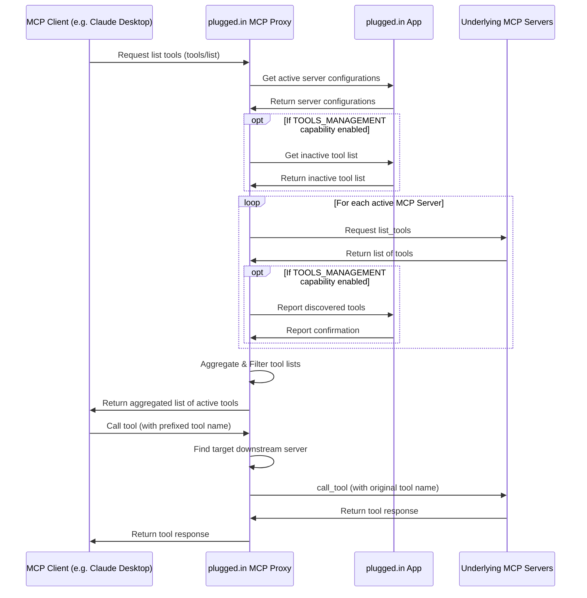

# plugged.in MCP Proxy Server

<div align="center">
  
  <h3>The Crossroads for AI Data Exchanges</h3>
  <p>A unified interface for managing all your MCP servers</p>

  [](https://github.com/VeriTeknik/pluggedin-mcp/stargazers)
  [](LICENSE)
  [](https://www.typescriptlang.org/)
  [](https://modelcontextprotocol.io/)
</div>

## 📋 Overview

The plugged.in MCP Proxy Server is a powerful middleware that aggregates multiple Machine Conversation Protocol (MCP) servers into a single unified interface. It fetches tool, prompt, and resource configurations from the [plugged.in App](https://github.com/VeriTeknik/pluggedin-app) and intelligently routes requests to the appropriate underlying MCP servers.

This proxy enables seamless integration with any MCP client (Claude, Cline, Cursor, etc.) while providing advanced management capabilities through the plugged.in ecosystem.

## ✨ Key Features

- **Universal MCP Compatibility**: Works with any MCP client including Claude Desktop, Cline, and Cursor
- **Multi-Server Support**: Connect both STDIO (command-line) and WebSocket (HTTP-based) MCP servers
- **Namespace Isolation**: Keep joined MCPs separate and organized with proper prefixing
- **Multi-Workspace Layer**: Switch between different sets of MCP configurations with one click
- **Real-time Updates**: Dynamic updates of MCP configurations through the plugged.in App
- **Tool Management**: Discover, report, and manage tools across all connected MCP servers
- **Intelligent Routing**: Automatically route tool calls to the appropriate underlying MCP server
- **Streamable HTTP Support**: Implements the latest MCP specification for streaming responses

## 🚀 Quick Start

### Prerequisites

- Node.js 18+ (recommended v20+)
- An API key from the plugged.in App (get one at [plugged.in/api-keys](https://plugged.in/api-keys))

### Installation

```bash
# Install and run with npx
npx -y @pluggedin/mcp-proxy@latest --pluggedin-api-key YOUR_API_KEY
```

### Configuration for MCP Clients

#### Claude Desktop

Add the following to your Claude Desktop configuration:

```json
{
  "mcpServers": {
    "pluggedin": {
      "command": "npx",
      "args": ["-y", "@pluggedin/mcp-proxy@latest"],
      "env": {
        "PLUGGEDIN_API_KEY": "YOUR_API_KEY"
      }
    }
  }
}
```

#### Cline

Add the following to your Cline configuration:

```json
{
  "mcpServers": {
    "pluggedin": {
      "command": "npx",
      "args": ["-y", "@pluggedin/mcp-proxy@latest"],
      "env": {
        "PLUGGEDIN_API_KEY": "YOUR_API_KEY"
      }
    }
  }
}
```

#### Cursor

For Cursor, you can use command-line arguments instead of environment variables:

```bash
npx -y @pluggedin/mcp-proxy@latest --pluggedin-api-key YOUR_API_KEY
```

## ⚙️ Configuration Options

### Environment Variables

| Variable | Description | Required | Default |
|----------|-------------|----------|---------|
| `PLUGGEDIN_API_KEY` | API key from plugged.in App | Yes | - |
| `PLUGGEDIN_API_BASE_URL` | Base URL for plugged.in App | No | `https://plugged.in` |

### Command Line Arguments

Command line arguments take precedence over environment variables:

```bash
npx -y @pluggedin/mcp-proxy@latest --pluggedin-api-key YOUR_API_KEY --pluggedin-api-base-url https://your-custom-url.com
```

For a complete list of options:

```bash
npx -y @pluggedin/mcp-proxy@latest --help
```

## 🐳 Docker Usage

You can also build and run the proxy server using Docker.

### Building the Image

Ensure you have Docker installed and running. Navigate to the `pluggedin-mcp` directory and run:

```bash
docker build -t pluggedin-mcp-proxy:latest .
```

A `.dockerignore` file is included to optimize the build context.

### Running the Container

Run the container, providing the necessary environment variables:

```bash
docker run -it --rm \
  -e PLUGGEDIN_API_KEY="YOUR_API_KEY" \
  -e PLUGGEDIN_API_BASE_URL="YOUR_API_BASE_URL" \
  --name pluggedin-mcp-container \
  pluggedin-mcp-proxy:latest
```

Replace `YOUR_API_KEY` and `YOUR_API_BASE_URL` (if not using the default `https://plugged.in`).

### Testing with MCP Inspector

While the container is running, you can connect to it using the MCP Inspector:

```bash
npx @modelcontextprotocol/inspector docker://pluggedin-mcp-container
```

This will connect to the standard input/output of the running container.

### Stopping the Container

Press `Ctrl+C` in the terminal where `docker run` is executing. The `--rm` flag ensures the container is removed automatically upon stopping.

## 🏗️ System Architecture

The plugged.in MCP Proxy Server acts as a bridge between MCP clients and multiple underlying MCP servers:



## 🔄 Workflow

1. **Configuration**: The proxy fetches server configurations from the plugged.in App
2. **Tool Discovery**: The proxy connects to each configured MCP server and discovers available tools
3. **Tool Reporting**: Discovered tools are reported back to the plugged.in App for management
4. **Tool Aggregation**: All active tools are aggregated and presented to the MCP client
5. **Request Routing**: Tool calls from the client are routed to the appropriate underlying MCP server
6. **Response Handling**: Responses from the underlying servers are returned to the client

## 🧩 Integration with plugged.in App

The plugged.in MCP Proxy Server is designed to work seamlessly with the [plugged.in App](https://github.com/VeriTeknik/pluggedin-app), which provides:

- A web-based interface for managing MCP server configurations
- Tool discovery and management capabilities
- Multi-workspace support for different configuration sets
- An interactive playground for testing MCP tools
- User authentication and API key management

## 📚 Related Resources

- [plugged.in App Repository](https://github.com/VeriTeknik/pluggedin-app)
- [Machine Conversation Protocol (MCP) Specification](https://modelcontextprotocol.io/)
- [Claude Desktop Documentation](https://docs.anthropic.com/claude/docs/claude-desktop)
- [Cline Documentation](https://docs.cline.bot/)

## 🤝 Contributing

Contributions are welcome! Please feel free to submit a Pull Request.

## 📄 License

This project is licensed under the MIT License - see the [LICENSE](LICENSE) file for details.

## 🙏 Acknowledgements

- Inspired by the [MCP Proxy Server](https://github.com/adamwattis/mcp-proxy-server/)
- Built on the [Machine Conversation Protocol](https://modelcontextprotocol.io/)
