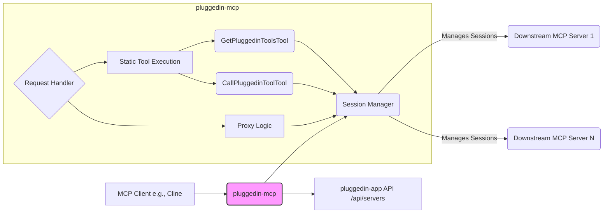

# System Patterns: pluggedin-mcp

*This file documents the system's architecture, key technical decisions, design patterns, and component relationships.*

## Architecture Overview

`pluggedin-mcp` functions as a **Proxy** and **Aggregator** for downstream MCP servers.

*   **Client Interaction:** Standard MCP clients connect to `pluggedin-mcp`.
*   **Configuration:** `pluggedin-mcp` fetches the list and connection details of downstream servers from the `pluggedin-app` backend API using an API key.
*   **Session Management:** It maintains persistent sessions (connections) with active downstream servers.
*   **Request Handling:**
    *   `tools/list`: Returns static tool definitions (`get_pluggedin_tools`, `call_pluggedin_tool`).
    *   `tools/call` for static tools: Executes the logic within `GetPluggedinToolsTool` (fetches/aggregates proxied tools) or `CallPluggedinToolTool` (finds downstream server and proxies the actual tool call).
    *   Other requests (`resources/list`, `resources/templates/list`, `resources/read`, `prompts/list`, `prompts/get`): Proxies the request to all relevant downstream servers and aggregates the results.

## Key Technical Decisions

*   **Static Tools for Discovery:** Implemented `get_pluggedin_tools` and `call_pluggedin_tool` as static entry points to ensure compatibility with discovery platforms like Smithery, mimicking the pattern seen in `veyrax-mcp`.
*   **Dynamic Proxying:** Core functionality relies on dynamically fetching server configurations and proxying requests, rather than hardcoding downstream server details.
*   **Session Management:** Uses a session management layer (`sessions.ts`) to maintain connections to downstream servers efficiently.
*   **API Key Authentication:** Uses an API key to authenticate with the `pluggedin-app` backend for fetching server configurations.
*   **Security Focus:** Requires careful handling of API keys and proxied requests. Associated `pluggedin-app` implements validation to ensure tool reports belong to the authenticated user.

## Design Patterns

*   **Proxy Pattern:** The server acts as a proxy, providing a surrogate or placeholder for other MCP servers.
*   **Aggregator Pattern:** It aggregates capabilities (tools, resources, etc.) from multiple sources (downstream servers).
*   **Facade Pattern (loosely):** Provides a simplified, unified interface (the single `pluggedin-mcp` endpoint) to a more complex subsystem (multiple downstream MCP servers).

## Component Relationships

*   `index.ts`: Entry point, CLI argument parsing, server initialization.
*   `mcp-proxy.ts`: Core server logic, request handlers, static tool routing.
*   `tools/`: Contains the static tool implementations (`GetPluggedinToolsTool`, `CallPluggedinToolTool`).
*   `fetch-pluggedinmcp.ts`: Logic for fetching server list from `pluggedin-app` API.
*   `fetch-tools.ts`: Logic for fetching *inactive* tool status from `pluggedin-app` API.
*   `fetch-capabilities.ts`: Logic for fetching profile capabilities from `pluggedin-app` API.
*   `report-tools.ts`: Logic for reporting discovered tools back to the `pluggedin-app` API.
*   `sessions.ts`: Manages connections/sessions with downstream MCP servers.
*   `client.ts`: Wrapper around the MCP SDK client.
*   `utils.ts`: Utility functions (e.g., name sanitization, session key generation).

## Data Flow

1.  **Configuration Fetch:** `pluggedin-mcp` -> `pluggedin-app` API (fetch server list).
2.  **Client Request:** MCP Client -> `pluggedin-mcp` Request Handler.
3.  **Static Tool List:** Request Handler -> Returns static tool definitions.
4.  **Static Tool Call (`get_pluggedin_tools`):** Request Handler -> `GetPluggedinToolsTool.execute` -> Session Manager -> Downstream Servers (`tools/list`) -> Aggregate -> Return proxied tool list to Client.
5.  **Static Tool Call (`call_pluggedin_tool`):** Request Handler -> `CallPluggedinToolTool.execute` -> Find Session -> Downstream Server (`tools/call`) -> Return result to Client.
6.  **Other Proxied Requests (e.g., `resources/list`):** Request Handler -> Session Manager -> Downstream Servers (`resources/list`) -> Aggregate -> Return results to Client.
